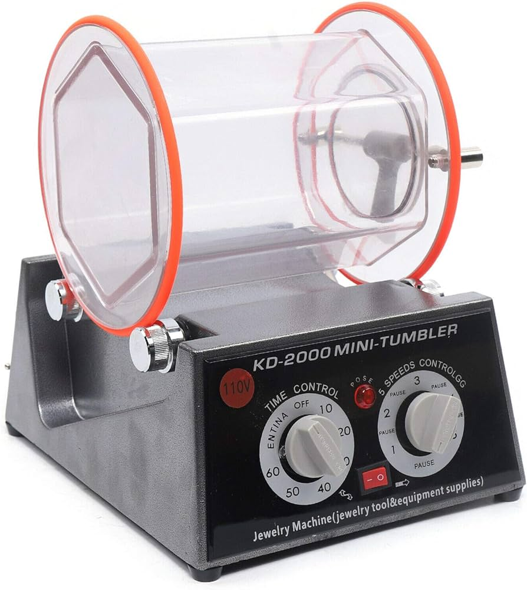

# Bienvenue sur notre documentation

Bienvenue dans la documentation du projet de **polisseuse pour objet 3D**. Ce site a pour but de fournir toutes les informations nécessaires pour comprendre, utiliser et reproduire efficacement notre projet.
Un "rotary tumbler" ou polisseuse de pièces 3D fait polir un objet grace à un cylindre rempli avec du sable abrasif qui tournera pendant quelques heures. On peut trouver 2 parties un cylindre avec le sable et l'objet à polir et un socle avec un écran, des boutons, à l'intérieur du socle on trouve une carte éléctronique, une microprocesseur et un moteur.

## À propos du Projet

Décrivez ici en quelques lignes l'objectif et l'aperçu général de votre projet. Quel est son but ? À qui est-il destiné ? Quels problèmes cherche-t-il à résoudre ?

## Poster

Ici vous publierez le poster de votre projet.

## Vidéo

Ici vous publierez la vidéo de votre projet. 
- Moins de 1min30
- Présentation du projet 
- Des explication du fonctionnement du projet
- Des vues du projet / Prototype / Application etc... 
- Des plans du fonctionnement (même basique ou des éléments séparés)
- Une conclusion
Si en stockage local : >50mo

<video src="images/intro_amiens.mp4" controls title="Title"  style="width: 100%;"></video>

---
